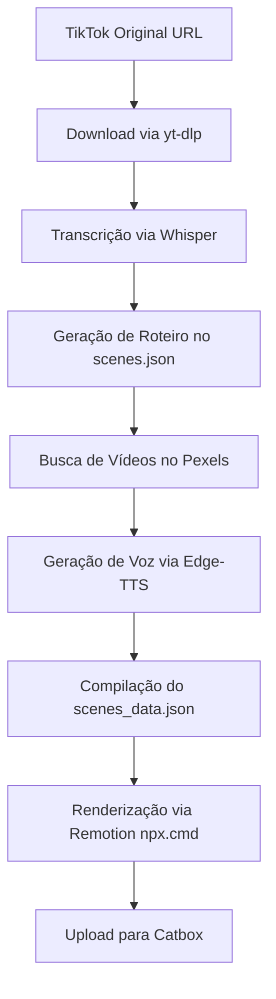

# Skill: MoneyPrinter Video Creator (Híbrido)

Esta skill capacita o agente a criar de forma autônoma vídeos altamente virais no formato vertical (9:16) para TikTok, Reels e Shorts com duração superior a 1 minuto, utilizando o pipeline padronizado que combina bancos de vídeo reais (Pexels) e imagens geradas por Inteligência Artificial (FLUX).

---

## 🛠️ Arquitetura do Pipeline

O pipeline padrão do projeto está dividido em etapas coordenadas:



### 1. Roteiro e Cenas (`scenes.json`)
O roteiro deve possuir no mínimo 9 cenas com duração cumulativa estimada de 80 a 100 segundos para garantir a meta de 1 minuto. Cada cena aceita os seguintes campos:
* `"visual_type"`: `"video"` (padrão para clipes reais) ou `"image"` (para retrato fotorrealista).
* `"pexels_query"`: Termo de busca curto em inglês específico para buscar no Pexels.
* `"narration"`: O texto narrado em português.
* `"visual_prompt"`: O prompt detalhado fotorrealista para o fallback de imagem FLUX.

### 2. Busca e Download de Vídeos (`fetch_stock_videos.py`)
Conecta na API do Pexels buscando clipes verticais (`orientation=portrait`). Salva os arquivos como `public/scene_{i}.mp4`.

### 3. Processamento de Ativos (`generate_assets.py`)
* Invoca o script do Pexels automaticamente.
* Gera voz natural de alto padrão usando `edge-tts` (Voz: `pt-BR-AntonioNeural`).
* Gera legendas dinâmicas divididas proporcionalmente por tempo de fala.
* Caso um vídeo do Pexels falhe em baixar ou não exista, o script gera automaticamente a imagem de fallback via FLUX (com fallback para Pollinations.ai), garantindo robustez de 100% livre de falhas.
* Ajusta e estica matematicamente o timeline para atingir exatamente o mínimo de 60 segundos se o áudio narrado for menor.

### 4. Compilação e Renderização (`remotion`)
A renderização é feita em segundo plano chamando o executável correto do Windows (`npx.cmd` para evitar restrições de script do PowerShell):
```bash
npx.cmd remotion render ViralVideo output/final_video.mp4 --gl=angle
```

### 5. Upload e Informações de Saída (`upload.py`)
O vídeo é carregado nos servidores e as informações (link e legenda viral) são gravadas em `output_info.json` e relatadas no `walkthrough.md`.

---

## 🚀 Como Executar o Processo Completo

Para gerar um novo vídeo do início ao fim com base em uma nova história:

1. **Limpar Ativos Anteriores:**
   ```powershell
   Remove-Item -Path public/scene_*.mp4, public/image_*.jpg -ErrorAction SilentlyContinue
   ```
2. **Definir o Roteiro:** Salvar o novo roteiro com os campos `"visual_type": "video"` e `"pexels_query"` dentro de `scenes.json`.
3. **Gerar Ativos:**
   ```powershell
   py -u generate_assets.py
   ```
4. **Renderizar Vídeo:**
   ```powershell
   npx.cmd remotion render ViralVideo output/final_video.mp4 --gl=angle
   ```
5. **Fazer Upload:**
   ```powershell
   py scratch/upload.py
   ```
